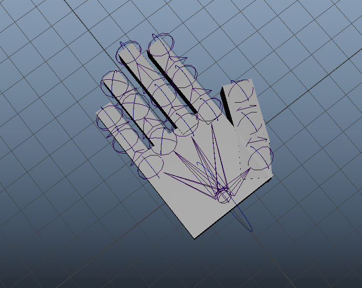

# My Maya Plugins

# HandRigger

What it does:

* Creates an automatic hand rig
* Enables to move the entire hand with the wrist joint

Pros:
* Makes it easier to create an entire hand
* Inserted Joints with the Rigs included
* Moves the entire hand by the rig of the wrist

Cons:
* The rigs and the joints are not connected, needs to be parented (Selected the rig and the joint > Parent/Constrant)
* Needs to have freeze transformation after placing where you want the rig and joints to go
* Can't reduce the size of the joint
