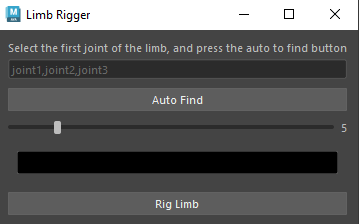

# My Maya Plugins

## Limb Rigger




this plugin rigs any  3 joint limb with ik and fk and ikfk blend.

* support auto joint finding 
* controller size control
* controller color control

# Proxy Generator

This imports all of the other functions that were made previously to create more space and for them to maturally connect to Maya.
* Reloads = saves recent changes in Maya
* MayaUtilities = Imports all functions
* Qt Widgets = Builds UI's in Maya

```python
import importlib
import MayaUtilities
importlib.reload(MayaUtilities)

from MayaUtilities import *
from PySide2.QtWidgets import QLabel, QVBoxLayout, QPushButton
import maya.cmds as mc
```
This class is called ProxyGenerator, is a mesh based on skinning  data and joint influences that is directly connected to Maya.

* self.skin: stores the skin cluster influencing the mesh.
* self.model: stores the name of the selected model (mesh).
* self.jnts: stores joints influencing the skin.
* skin = GetAllConnectionsIn(modelShape, GetUpperStream, IsSkin) = Connects the skin cluster upstream of the model's shape
* jnts = GetAllConnectionsIn(modelShape, GetUpperStream, IsJoint) = Enables all joints influencing  the mesh through skin cluster.
* modelShape = mc.listRelatives(self.model, s=True)[0] = Gets shape node of the model, necessary for connecting to deformation history
* if not IsMesh(model) = if something else is selected that isn't a mesh, an error will appear
* model = mc.ls(sl=True)[0] = First selected object in the Maya Scene
* print(f"found model {self.model} with skin {self.skin} and joins: {self.jnts}") = prints what's found
* for jnt, verts in jntVertDict.items():
    newChunck = self.CreateProxyModelForJntAndVerts(jnt, verts) = Creates a proxy mesh for the part of the mesh of each joint it influences

```python
class ProxyGenerator:
    def __init__(self):
        self.skin = ""
        self.model = ""
        self.jnts = []

    def BuildProxyForSelectedMesh(self):
        model = mc.ls(sl=True)[0]
        if not IsMesh(model):
            print(f"{model} is not a mesh!")
            return
        
        self.model = model
        modelShape = mc.listRelatives(self.model,s=True)[0]
        skin = GetAllConnectionsIn(modelShape, GetUpperStream, IsSkin)
        if not skin:
            print(f"{self.model} is not bound with any joint")
            return
        jnts = GetAllConnectionsIn(modelShape, GetUpperStream, IsJoint)
        if not jnts:
            print(f"{self.model} is not bound with any joint")
            return
        
        self.skin = skin[0]
        self.jnts = jnts
        print(f"found model {self.model} with skin {self.skin} and joins: {self.jnts}")

        jntVertDict = self.GenerateJntVertsDict()
        chuncks = []
        ctrls = []
        for jnt, verts in jntVertDict.items():
            newChunck = self.CreateProxyModelForJntAndVerts(jnt, verts)
```
* faces = mc.polyListComponentConversion(verts, fromVertex=True, toFace=True)
faces = mc.ls(faces, fl=True) = Converts the list of vertices to their associated polygon faces.
* faceNames = set()
for face in faces:
    faceNames.add(face.replace(self.model, "")) = Removes the model prefix from each face name to get just the face indices and stores for compairison
* dup = mc.duplicate(self.model)[0] = Duplicates the full model
* allDupFaces = mc.ls(f"{dup}.f[*]", fl=True)
facesToDelete = []
for dupFace in allDupFaces:
    if dupFace.replace(dup,"") not in faceNames:
        facesToDelete.append(dupFace) = Collects all of the faces on the duplicate.
* mc.delete(facesToDelete) = Deletes all of the faces that weren't in the original face set 
* dupName = self.model + "_" + jnt + "_proxy"
mc.rename(dup, dupName)
return dupName = Renames the remaining model
```python
def CreateProxyModelForJntAndVerts(self, jnt, verts):
        if not verts:
            return None
        
        faces = mc.polyListComponentConversion(verts, fromVertex=True, toFace=True)
        faces = mc.ls(faces, fl=True)

        faceNames = set()
        for face in faces:
            faceNames.add(face.replace(self.model, ""))

        dup = mc.duplicate(self.model)[0]
        allDupFaces = mc.ls(f"{dup}.f[*]", fl=True)
        facesToDelete = []
        for dupFace in allDupFaces:
            if dupFace.replace(dup,"") not in faceNames:
                facesToDelete.append(dupFace)

        mc.delete(facesToDelete)

        dupName = self.model + "_" + jnt + "_proxy"
        mc.rename(dup, dupName)
        return dupName
```